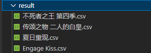

# spider-animate


## 简述
为了便利舍弃通用性，毕竟这软件就是自用的

## 打包
```
pyinstaller -F ./main.py --noconsole -p C:\Users\dell\AppData\Local\Programs\Python\Python39\Lib;C:\Users\dell\AppData\Local\Programs\Python\Python39\Lib\site-packages; 
```

## 直接使用
* 下载spider-animate.zip，解压后得到两个文件：Animation.db、xxx.exe
* 执行exe，弹出界面，通过年份季度筛选，目前爬取动漫目录固定。


* 选择需要爬取的目标，点击爬取按钮，等待打印窗口提示爬取完成，然后在执行这个软件目录会有一个result文件夹，该文件夹存放所有爬取动漫的信息。



* 打开后能看到名称、大小、和磁力链接、种子链接
