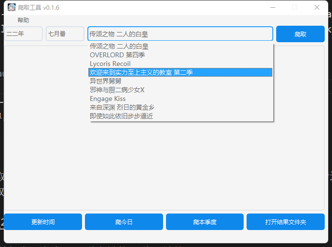
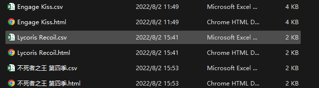

# spider-animate

## 使用
* 下载spider-animate.exe
* 在运行目录建立一个target.txt，每一行为一个爬取目标，尽量多写标签，减少搜索量，例如： [NC-Raws] 传颂之物 二人的白皇
* 双击运行exe，下拉框选择需要爬取的内容，点击爬取按钮，等待显示框提示爬取完成。

* 在运行程序的目录会看到你爬取内容的文件夹，里面存放了一个csv文件，里面保存了文件名、种子链接、磁力链接、大小、时间
